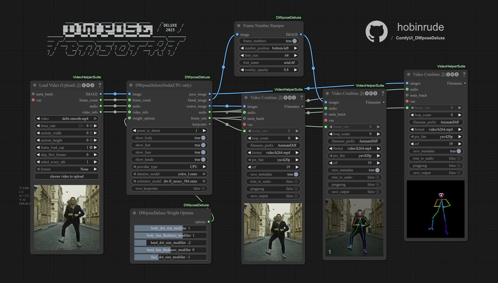

# ComfyUI DWpose Deluxe


**Pre-release sneak-peek**

A pimped up custom node for ComfyUI that integrates the DW-Pose (Denoising Whole-Body Pose Estimation) model for high-quality pose detection. This node supports both CPU (ONNX) and high-performance GPU (TensorRT) execution, with automatic model downloading and engine building. Runs on average 20x faster than pose estimators without TensorRT engine booster. Added functionality for drawing feet, composite image with optional frame count for pose debugging, json dataset output and json converter node which can convert pixel-absolute coordinates to canvas-relative format.


## Key Features

- **Dual Execution Providers**: Choose between CPU (ONNX) for broad compatibility and GPU (TensorRT) for maximum performance.

- **Automatic Setup**:
    - Automatically downloads the required ONNX models on first use.
    - Automatically builds and caches optimized TensorRT engines when the GPU provider is selected for the first time.

- **Modular Workflow**: Comes with three distinct nodes for a flexible and powerful workflow:
    - `DWposeDeluxeNode`: The core node for performing pose estimation.
    - `DWposeDeluxe Weight Options`: Fine-tune the visual style of the rendered pose skeleton, such as dot size and line thickness.
    - `DWposeDeluxe Keypoint Converter`: A utility node to convert keypoint data between absolute (pixel) and normalized (percentage) coordinates.
    - `DWposeDeluxe Frame Numbering`: Prints frame numbers onto any video. Lets you set custom font, size and pick corner at wish.

- **Rich I/O**:
    - **`pose_image`**: The generated pose skeleton on a black background.
    - **`blend_image`**: A 50/50 blend of the source image and the pose image.
    - **`face_image`**: Face crop of source image (multipose)
    - **`source_image`**: A passthrough of the original input image.
    - **`audio`**: A passthrough for the audio channel from video inputs.
    - **`frame_rate`**: The frame rate derived from the `video_info` input.
    - **`keypoints`**: Raw pose keypoints in a structured JSON format.

- **Advanced Customization**:
    - Toggle visibility for face, hands, and feet in the final pose.
    - Set confidence threshold per individual subset.
    - Adjust size and thickness of pose elements.
    - Save generated keypoint data directly to your ComfyUI output directory.
    - Optional pretty JSON output (human-readible).
    - Add a frame number overlay to batch outputs, helpful by pose debugging.

- **Video Workflow Ready**: Includes `audio` and `video_info` input, `frame_count` and `frame_rate` outputs, `source_image` and `audio` pass-through to seamlessly integrate with video load/combine nodes. Cropped `face_image` easy face reference for models like WAN Animate (supports multiple poses).


**Full Pose With Feet (optional)**


## Installation

Use **ComfyUI-Manager** and search for **DWposeDeluxe**
(it assumes CUDA 12.X by default - see `Dependencies`)

or install manually:

1.  Navigate to your ComfyUI installation directory.

2.  Clone this repository into the `custom_nodes` folder:
    ```bash
    cd ComfyUI/custom_nodes/
    git clone https://github.com/hobinrude/ComfyUI_DWposeDeluxe
    ```

3.  Navigate into the newly cloned directory:
    ```bash
    cd ComfyUI_DWposeDeluxe
    ```

4.  Install the required dependencies:
     ( assumes CUDA 12.X by default )
    ```bash
    pip install -r requirements.txt
    ```

5.  Start or restart ComfyUI.


## How to Use

1.  In ComfyUI, add the **`DWposeDeluxeNode`** to your workflow.

2.  Connect an image source (e.g., from a Load Image or Load Video node) to the `image` input.

3.  **Select the `provider_type`**:
    - **`CPU`**: Uses the ONNX runtime. Models will be downloaded automatically if not found in `ComfyUI/models/dwpose/`.
    - **`GPU`**: Uses the TensorRT runtime. The first time you select this, the node will build optimized `.trt` engine files. This may take several (5-6) minutes, but subsequent runs will be significantly faster - 20x the speed of regular `.onnx` models.

4.  (Optional) Add the **`DWposeDeluxe Weight Options`** node and connect its `options` output to the `weight_options` input on the main node to customize the appearance of the pose by setting modifier values for dot size and bone thickness.

5.  (Optional) Connect the `keypoints` output to the **`DWposeDeluxe Keypoint Converter`** node to transform the keypoint data if downstream nodes require different formats.

6.  Set **`poses_to_detect`** to a specific number to eliminate detections of unwanted background photo-bombers. This works based on bounding box size so will only detect X biggest poses in each frame (can currently be a bit glitchy, but more stable and accurate pose tracking methods will be added soon)

7. Connect `face_image` as face reference for models like WAN Animate or StableDancer. Can output multiple faces when more than one poses is detected. Use downstream crop node to get individual face.

8. Some common user-side errors are suppressed with `InterruptProcessingException` so always check console output for error logs if your workflow gets quietly interrupted during pose detection.


**Basic Example Workflow Included**




## Dependencies

This node requires the following Python libraries:

```
tensorrt-cu12
onnxruntime-gpu
opencv-python
matplotlib
polygraphy
colored
```

These can be installed by running `pip install -r requirements.txt` from within the node's directory.
If you're using CUDA 11.X or 13.X modify the TensorRT version in `requirements.txt` accordingly.

or install manually with:
`pip install tensorrt-cu11`
`pip install tensorrt-cu12`
`pip install tensorrt-cu13`

To use without GPU support a CPU `onnxruntime` is needed. Manually change it in `requirements.txt`.


## Changelog

- 2025-12-02
  - Added `face_image` crop from source by bbox
  - Fixed normalized and pretty JSON output of Converter node
  - Added visibility thresholds by detection confidence per keypoint in subset 

- 2025-11-26
  - Major UI and inference bugfixes
  - Improved console logging
  - Separate node for frame numbers


## Known issues

- Not enough stars 🤪

This node pack is still under development but feel free to report any `Issues`.
Same goes for additional feature requests, which are more than welcome in `Issues` section.


## Fun fact

It works even on prehistoric setups like Core 2 Duo (direct successor of 486 processors) with 4GB of DDR3 🥹


## Acknowledgements & License

This project is heavily based on the work of **yuvraj108c** and his original **[ComfyUI-Dwpose-Tensorrt](https://github.com/yuvraj108c/ComfyUI-Dwpose-Tensorrt)** repository. Big chunks of code have been repurposed straight from his project.

If you like this node pack and find it useful, please consider giving a star to the original repository and buying the original author a coffee, not me!


#### Licensing Notice

Due to the "ShareAlike" clause in the original project's license, this project is also licensed under the **[Creative Commons Attribution-NonCommercial-ShareAlike 4.0 International (CC BY-NC-SA 4.0)](http://creativecommons.org/licenses/by-nc-sa/4.0/)**.

This means:
-   You must give appropriate credit (Attribution).
-   You may not use this material for commercial purposes (NonCommercial).
-   If you remix, transform, or build upon the material, you must distribute your contributions under the same license (ShareAlike).


**Enjoy Responsibly**
